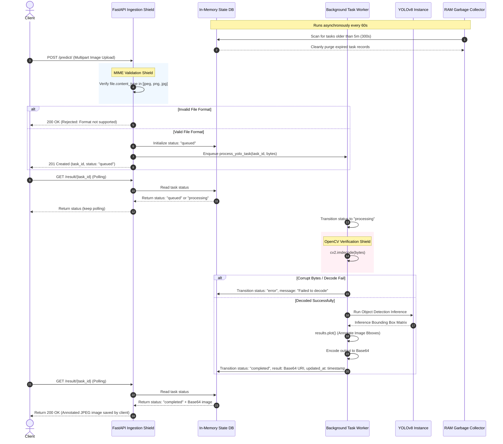

# 🚀 Production-Ready Asynchronous YOLOv8 Object Detection API

[](https://fastapi.tiangolo.com/)
[](https://www.python.org/)
[](https://www.docker.com/)
[](https://huggingface.co/spaces)
[](https://opensource.org/licenses/MIT)

**Scaling YOLOv8 Deep Learning Inference Beyond Single-Threaded Toy Scripts**

🔗 **Project Portal:** [GitHub Repository](https://github.com/manumezog/yolo-queue-api) | [Live API Swagger Docs](https://manumezog-yolo-queue-api.hf.space/docs)

---

## 📌 Executive Summary

In computer vision engineering, moving a deep learning model from a local testing script (`model.predict()`) into a production cloud environment introduces severe compute bottlenecks. Deep learning inference is extremely CPU/GPU intensive. When multiple clients send high-resolution image payloads concurrently to a standard synchronous API, the server threads freeze. This results in socket timeouts, thread/RAM exhaustion, and container crashes.

To resolve this, I engineered a **Production-Ready Asynchronous Object Detection API** using **FastAPI** and **YOLOv8**. By leveraging an asynchronous queueing pattern, the API decouples long-running model inference into non-blocking sequential background tasks, protecting cloud hardware from resource starvation while maintaining high service availability.

---

## 🏛️ System Architecture

The application decouples client requests from heavy model execution using a non-blocking background queue and an asynchronous state polling pattern:



### Architectural Breakdown

1. **The Ingestion Shield (`POST /predict/`):** Accepts multi-part file uploads. Validates MIME headers instantly to reject invalid formats (e.g., PDFs, executables) before consuming downstream RAM/CPU resources.
2. **The Asynchronous Queue:** Generates a unique UUID `task_id`, initializes a task record in the state database, schedules the heavy processing onto a background thread pool, and immediately responds with `201 Created`.
3. **The Worker Loop:** Dynamically decodes the binary image stream into raw OpenCV matrices (`cv2.imdecode`), feeds it into a pre-loaded YOLOv8 instance, plots bounding boxes, and encodes the output as a Base64 JPEG data URL.
4. **The Polling State Machine (`GET /result/{task_id}`):** The client queries this endpoint concurrently. The server handles reads asynchronously without blocking incoming request traffic.

---

## 🧹 Engineering Challenges & Production Hardening

### 1. Eliminating Container OOM (Out Of Memory) Crashes

> [!CAUTION]
> **The Problem:** Storing image results (massive Base64 string structures) in an in-memory dictionary (`tasks_db`) causes RAM usage to scale linearly with traffic. Under automated high-concurrency loads, the container quickly hits memory limits, triggering the OS Kernel's **OOM Killer** to terminate the FastAPI process.

**The Solution:** I engineered a high-efficiency background garbage collection daemon utilizing a low-overhead **Daemon Thread** (`threading.Thread(..., daemon=True)`). 

* The thread wakes up automatically every 60 seconds.
* It calculates the delta between the current timestamp and task completion: 
  $$\Delta t = t_{\text{current}} - t_{\text{updated\_at}}$$
* If $\Delta t > 300\text{ seconds}$ (5 minutes), the task is cleanly scrubbed from RAM.
* Because it runs as a *daemon thread*, its lifecycle is bound directly to the master FastAPI process, preventing zombie memory leaks during system restarts.

```python
def fastapi_queue_cleaner():
    """Background loop that checks tasks_db and purges items older than 5 minutes."""
    while True:
        current_time = time.time()
        expired_tasks = []
        for task_id, task_info in list(tasks_db.items()):
            updated_at = task_info.get("updated_at", 0)
            if current_time - updated_at > 300: # 5 minutes
                expired_tasks.append(task_id)
        for task_id in expired_tasks:
            del tasks_db[task_id]
        time.sleep(60)
```

---

### 2. Defensive Exception Interception

OpenCV's `cv2.imdecode` returns a quiet `None` object if the uploaded image byte-stream is corrupted or invalid, which traditionally crashes the YOLOv8 inference pipeline. I implemented an explicit matrix verification layer to intercept corrupted uploads early:

```python
nparr = np.frombuffer(file_bytes, np.uint8)
img = cv2.imdecode(nparr, cv2.IMREAD_COLOR)

if img is None:
    raise ValueError("Failed to decode image: corrupted or invalid format")
```

This ensures low-level C++ decoding errors are gracefully translated into user-friendly HTTP error codes instead of server-side crashes.

---

### 3. Concurrency Stress-Testing & Performance Metrics

To prove the robustness of the decoupled queuing architecture, I developed an asynchronous multi-connection benchmarking tool using `asyncio` and `httpx`. The script simulates high concurrent request spikes by firing parallel image payloads to the ingestion queue and polling for results concurrently:

```ansi
--- INICIANDO ENVÍO EN PARALELO ---
🚀 [Tarea 1] Enviando imagen a la cola...
🚀 [Tarea 2] Enviando imagen a la cola...
🚀 [Tarea 3] Enviando imagen a la cola...
📥 [Tarea 2] Aceptada. ID: 185f9844-31f4-42ea-ba30-d36c5db6177b
📥 [Tarea 1] Aceptada. ID: 93445b71-12c8-479c-b4ba-115f088195a8
📥 [Tarea 3] Aceptada. ID: 8fb6c623-fa14-411a-8c90-93a8d11c5f0a

--- INICIANDO MONITOREO EN PARALELO ---
🔄 [Tarea 3] Verificando... Estado: processing
🔄 [Tarea 2] Verificando... Estado: processing
✨ [Tarea 2] ¡Éxito! Guardada como stress_output_2_185f9844.jpg
✨ [Tarea 1] ¡Éxito! Guardada como stress_output_1_93445b71.jpg
✨ [Tarea 3] ¡Éxito! Guardada como stress_output_3_8fb6c623.jpg

⏱️ Tiempo total de la prueba con alta concurrencia: 9.01 segundos
```

> [!TIP]
> **Key Takeaway:** Even under burst concurrent traffic, the API never drops requests or times out. It enqueues workloads safely, keeps socket threads open for incoming connections, and processes detection tasks sequentially.

---

## 📂 Repository Structure

```text
yolo-queue-api/
├── images/               # Sample images for local testing and validation
├── main.py               # Main FastAPI server with the non-blocking background queue
├── client.py             # Single-request polling client script
├── stress_test.py        # Asynchronous concurrent stress-test script
├── requirements.txt      # Python library dependencies
├── Dockerfile            # Production-grade multi-stage Docker build
└── README.md             # Project documentation (this file)
```

---

## 🛠️ Getting Started & Running Locally

### 1. Prerequisites
Ensure you have Python 3.9+ or Docker installed.

### 2. Installation
Clone the repository and install dependencies:
```bash
# Clone the repository
git clone https://github.com/manumezog/yolo-queue-api.git
cd yolo-queue-api

# Install dependencies
pip install -r requirements.txt
```

### 3. Running the FastAPI Server
Start the development server with live reloading:
```bash
uvicorn main:app --reload --port 8000
```
* **Local Swagger Documentation:** [http://127.0.0.1:8000/docs](http://127.0.0.1:8000/docs)
* **Local Redoc Documentation:** [http://127.0.0.1:8000/redoc](http://127.0.0.1:8000/redoc)

### 4. Running the Client Script
Open `client.py` and modify the `base_url` to point to your local server:
```python
# Change from cloud URL to local:
base_url = "http://127.0.0.1:8000"
```
Execute the single-request test client:
```bash
python client.py
```

### 5. Running the Asynchronous Stress Test
Open `stress_test.py`, modify `base_url` to your local address (`http://127.0.0.1:8000`), and run the high-concurrency simulation:
```bash
python stress_test.py
```

---

## 🐳 Docker Containerization

To package the API with all low-level graphics requirements (specifically solving the classic `libGL.so.1` dependency error commonly caused by headless OpenCV on bare Linux):

### 1. Build the Docker Image
```bash
docker build -t yolo-queue-api .
```

### 2. Run the Container
```bash
docker run -d -p 7860:7860 --name yolo-api yolo-queue-api
```
The API is now running isolated inside Docker and exposes the server at [http://localhost:7860](http://localhost:7860).

---

## 🛠️ Tech Stack & Key Tooling

* **Web Framework:** [FastAPI](https://fastapi.tiangolo.com/) (ASGI modern Python server framework built on Starlette and Pydantic)
* **Computer Vision:** [OpenCV](https://opencv.org/) (for byte-matrix manipulation and decoding) & [Ultralytics YOLOv8](https://github.com/ultralytics/ultralytics) (Deep learning inference engine)
* **Concurrency:** `asyncio` & [HTTPX](https://www.python-httpx.org/) (asynchronous HTTP calls for concurrent benchmarking)
* **Containerization:** [Docker](https://www.docker.com/) (slim Python base with custom package bindings)
* **Hosting:** Deployed via [Hugging Face Spaces](https://huggingface.co/spaces) in a custom Docker space.
